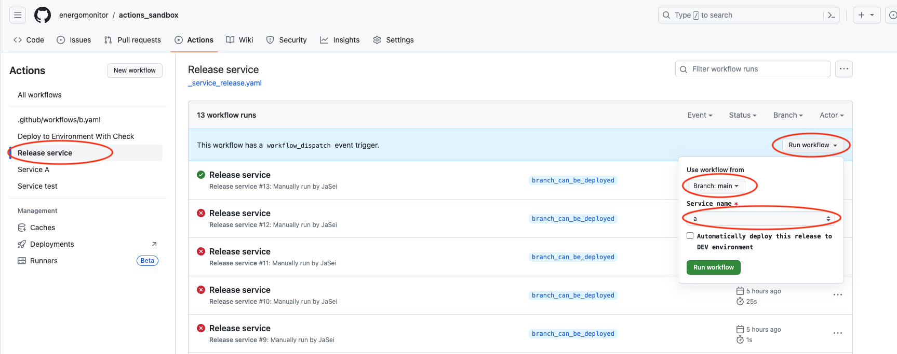
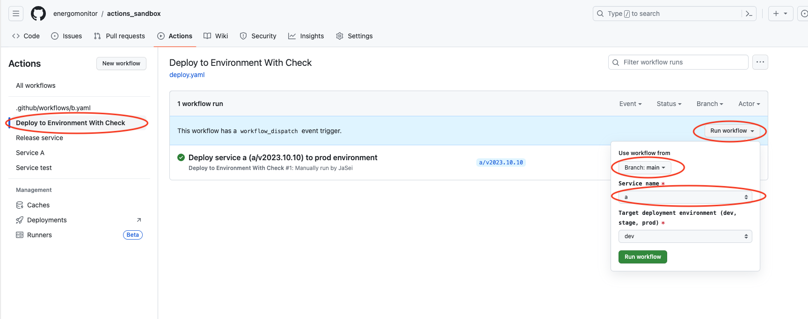
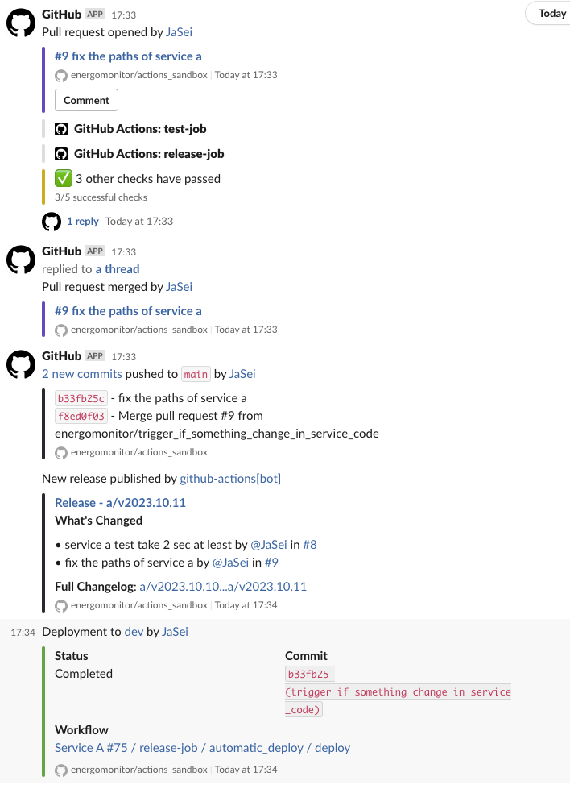

# Energomonitor GitHub Actions CI/CD Sandbox

## Introduction
This repository serves as a sandbox for testing continuous integration and continuous deployment (CI/CD) workflows using GitHub Actions.
The primary goal is to automate the deployment process and ensure a smooth delivery pipeline for your projects.

## Glossary
* **Release:** Build and tag docker image and push it to the registry
* **Deployment:** The docker image is automatically deployed to the target environment.

## CI/CD Pipeline Requirements.
* Support for more environments (dev and prod at least)
* Every commit in PR is checked by tests
* Manual deployment to environments
* Be able to deploy from branch
* Versioning
* Support monorepos (or more services in one repo)
* Support revert to previous image

## Nice to have
* Use the same git tags and docker tags
* Use GitHub releases to track what is being released
* Use GitHub Deployments to track what and where is deployed
* Fully/Semi-automated deployment

## Versioning

Tagging services is closely related to versioning.
I've chosen `CalVer` for this example.

Here are some common versioning standards:
* [SemVer](https://semver.org)
    * Great for libraries, not so good for services - more e.g. [this article](https://codereviewdoctor.medium.com/semver-might-not-be-right-for-you-8ed157537d36)
* [zer0ver](https://0ver.org)
    * Weird simplification of SemVer
* [CalVer](https://calver.org)
    * Looks promising for services (or anything where you don't need to track API changes)

# How to use

Follow these steps to effectively use the CI/CD workflow in the Energomonitor GitHub Actions CI/CD Sandbox:

## Create a Pull Request (PR)

When you have changes or new features to add, create a pull request. Automated tests are run to ensure the code meets the required standards.

## Review and merge

When the tests pass and the code review is complete, you can merge the pull request into the main branch.

## Testing in the development environment (optional)

If you need to test the code on a specific environment (e.g., dev), manually trigger the `Release service` (`_service_release.yaml`) workflow
by clicking the `Run workflow` button in GitHub Actions. This workflow prepares a `pre-release` image and tag that can be deployed to the desired environment for testing.

* Choose branch where the code is
* Choose the service which you want to build
* Check if you want to automaticaly deploy this build to the `dev` environment

Testing is simulated by the `test.sh` script.

## Post Merge Actions (Automatic)

* Docker image is built
* Tag docker image in format `{service}:{tag}`
* (docker image is pushed to registry - not implemented yet)
* Code is git tag in format `{service}/{tag}`
* New github release is created

#### Automatic deployment to development (Optional)

If you've configured your service accordingly, the merged changes can be automatically deployed to the development environment.

see example of `automatic_deploy_to_dev` option in [a.yaml](.github/workflows/a.yaml)

## Manual deployment to production

To deployt to production, manually initiate the deployment process using the `Deploy to Environment With Check` (`deploy.yaml`) workflow.

* Choose the tag (branch) from you want to deploy
* Choose the service name
* Choose the environment

The deployment is mocked by `deploy.sh` script.

## Revert

If you need to revert to previous version you just use manual deployment and choose the correct tag.

## Slack integration

We use Slack integration and with this ☝️ CI/CD everything will be nicely seen in Slack.

## Troubles with the current implementation
* environments (dev/stage/prod) are shared by all services
    * one solution could be combine `service_name` and `environment`
* `service_name` list (choice) are now defined on two places in the [deploy.yaml](.github/workflows/deploy.yaml) and [_service_release.yaml](.github/workflows/_service_release.yaml)
    * choice don't support dynamic creation
    * maybe somehow use environments with `service_name` for it?
* calver is now implemented in the `Makefile`
